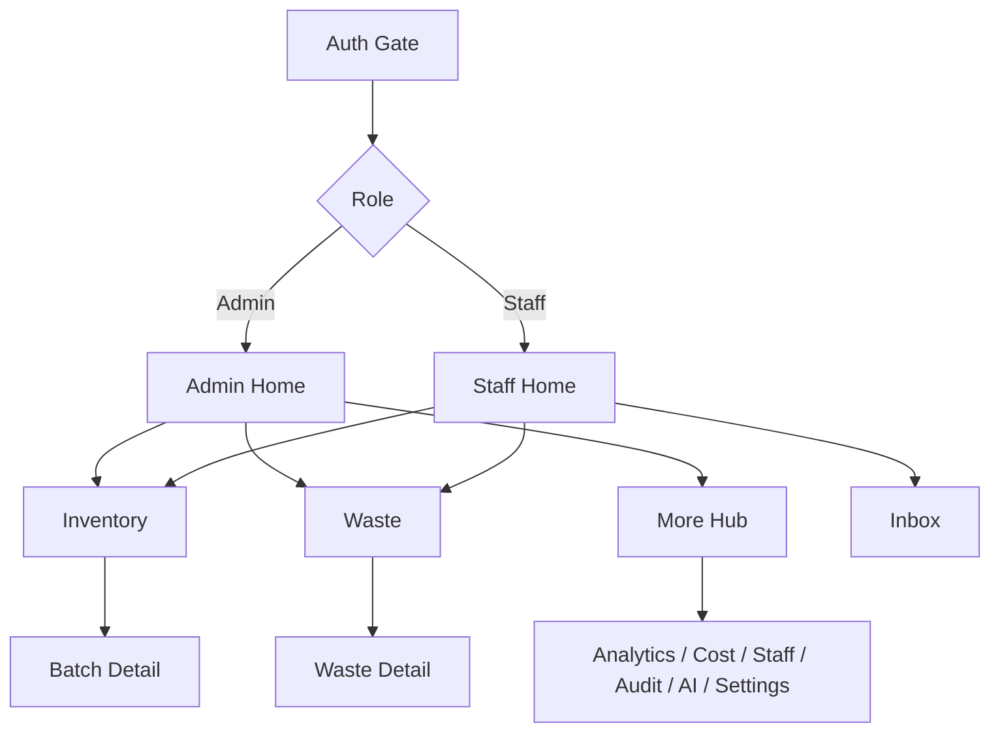

# Restora Complete UI/UX Redesign Specification v1.0

**Status:** Draft for approval — no UI code changes until signed off  
**Date:** 10 July 2026  
**Scope:** Visual system, information architecture, interaction patterns only  
**Out of scope:** Business logic, Firestore schema, RBAC rules, Cloud Functions behavior  

---

## Table of Contents

1. [Design Audit (Current App)](#1-design-audit-current-app)
2. [Reference Analysis](#2-reference-analysis)
3. [Product Design Vision](#3-product-design-vision)
4. [User Experience Strategy](#4-user-experience-strategy)
5. [Information Architecture](#5-information-architecture)
6. [Design System](#6-design-system)
7. [Component Design Library](#7-component-design-library)
8. [Screen-by-Screen UI Specification](#8-screen-by-screen-ui-specification)
9. [Dashboard Redesign Specification](#9-dashboard-redesign-specification)
10. [Data Visualization Guidelines](#10-data-visualization-guidelines)
11. [Responsive Design](#11-responsive-design)
12. [Accessibility Guidelines](#12-accessibility-guidelines)
13. [Interaction Design](#13-interaction-design)
14. [UX Improvements vs Current](#14-ux-improvements-vs-current)
15. [Cursor Implementation Guidelines](#15-cursor-implementation-guidelines)
16. [Approval Checklist](#16-approval-checklist)

---

## 1. Design Audit (Current App)

### 1.1 Current visual system

| Token | Current value | Notes |
|-------|---------------|--------|
| Primary | `#0F766E` | Teal — already Restora-branded |
| Background | `#F8FAFC` | Flat slate-white |
| Surface | `#FFFFFF` | Flat cards with 1px border |
| Radius | ~12–16px | Mild rounding |
| Spacing | 4 / 8 / 16 / 24 / 32 | Present but unevenly applied |
| Typography | System default | No display/body font pairing |
| Elevation | Borders only | Almost no shadow language |
| Tab bar | Flat system tabs | 5–6 labels, crowded on small phones |

### 1.2 Current UI patterns

- **Auth:** Form-first screens (login, admin/staff register, pending, rejected, forgot password)
- **Admin Home:** Welcome text + restaurant code card + stacked secondary buttons (Staff, Cost, Audit, Settings, Sign out) — **not a real dashboard**
- **Staff:** No home dashboard; lands on Inventory tab
- **Lists:** FlatList + bordered white cards (inventory, waste, inbox, audit)
- **Filters:** Horizontal chip rows
- **Charts:** Custom bar/trend components; functional but visually sparse
- **Components:** Button, Input, SelectField, DateField, EmptyState, LoadingState, InlineError, ConfirmDialog, StatusBadge, Avatar

### 1.3 UX problems

1. **Admin Home is a link dump** — no KPIs, no alerts summary, no quick actions for kitchen ops.
2. **Staff has no operational overview** — must hunt tabs for expiry pressure and waste tasks.
3. **Navigation overcrowding** — Admin tabs: Home, Inventory, Waste, Inbox, Analytics, AI (6 items). Secondary destinations (Cost, Staff, Audit, Settings) are buried.
4. **Weak hierarchy** — titles, body, and meta often compete; KPI numbers are not hero-scale.
5. **Inconsistent card language** — some screens use borders, some rely on whitespace only.
6. **Missing polish states** — empty/error/success exist in places but not as a unified pattern.
7. **Mobile thumb reach** — primary actions (Add Batch, Log Waste) are often top-right or mid-scroll, not thumb-zone.
8. **No floating primary CTA** — kitchen staff need one-handed “Log Waste / Add Batch”.
9. **Search is absent** on Home; inventory search exists but not elevated.
10. **Profile/avatar** not visible in chrome — identity and notifications are not always one tap away.

### 1.4 Missing / weak states

| State | Status |
|-------|--------|
| Loading | Present (`LoadingState`) but generic |
| Empty | Present but copy/visuals inconsistent |
| Error | `InlineError` only — no full-page recovery pattern |
| Offline | Not designed |
| Skeleton | Not used |
| Success toast | Mostly `Alert.alert` — interruptive |

### 1.5 Navigation issues

- Cost, Staff, Audit, Settings are stack-only (admin) — discoverability low.
- Staff Settings is a tab; Admin Settings is stack — asymmetric.
- Inbox badge exists; Home does not surface unread/expiry urgency.
- Deep links from push work; in-app path to same content is longer.

### 1.6 Audit summary

**Strengths:** Clear role split, solid functional coverage, teal brand seed, reusable form primitives.  
**Weaknesses:** Dashboard emptiness, tab overload, flat visual language, weak operational hierarchy.  
**Opportunity:** Adopt reference patterns (hero KPI, floating nav, lime accent CTAs, 2×2 metric grid) while keeping Restora’s restaurant semantics and existing teal DNA.

---

## 2. Reference Analysis

### 2.1 Reference A — Logistics / Shipment Dashboard

**Extracted principles**

| Pattern | Observation | Restora adaptation |
|---------|-------------|-------------------|
| Dark green header with soft curve | Strong brand plane + content separation | Use curved hero header on Admin/Staff Home only |
| Pill search in header | Global find | Search inventory + waste + staff (admin) |
| 2×2 KPI cards with trend pills | Instant health check | Inventory value, waste cost, expiring count, pending staff |
| Category icon in card corner | Scanability | Semantic icons: box, trash, clock, users |
| Analytics card with period chips | Contained chart module | Embed waste trend snippet on Home |
| Floating dark pill tab bar | Modern, thumb-friendly | Replace flat Expo tab chrome |
| Active tab = icon + label pill | Clear location | Active: lime pill; inactive: icon-only |

**Do not copy blindly**

- “Add New Shipment” → **Add Batch** / **Log Waste**
- Shipment analytics → **Waste / cost trends**
- Diagonal chart fill → optional; prefer solid soft fill for kitchen readability under bright lights

### 2.2 Reference B — Fintech Wallet Home

**Extracted principles**

| Pattern | Observation | Restora adaptation |
|---------|-------------|-------------------|
| Greeting + avatar + bell | Personal ops cockpit | Admin/Staff Home header |
| Hero metric on dark field | One number that matters | Admin: Inventory value; Staff: Items needing attention |
| Lime dual CTAs | Two primary jobs | Admin: Add Batch + Log Waste; Staff: Log Waste + View Inventory |
| Currency / context pills | Mode switch | Period pills (Today / 7d / 30d) or tone filter (All / Amber / Red) |
| Circular quick actions | 4 shortcuts | Staff, Cost, Alerts, AI (admin) |
| Recent list + See all | Continuity | Recent batches / recent waste / recent alerts |
| Center FAB on tab bar | Dominant action | Staff: Log Waste; Admin: Add Batch (role-aware) |

**Do not copy blindly**

- Wallet balance privacy eye → optional for cost figures on shared tablets
- Brand logos in list → ingredient category glyphs / expiry tone dots
- “Fund/Send” wording → kitchen verbs only

### 2.3 Shared design principles from both references

1. **Dark brand plane + light content plane**
2. **Lime accent for primary action / active state** (not for body text)
3. **Large radius (24–32)** for cards and nav
4. **Pill language** for filters, CTAs, badges
5. **Hero number** before secondary lists
6. **Floating bottom navigation**
7. **One primary thumb action** always reachable

---

## 3. Product Design Vision

### 3.1 Design goals

1. Make restaurant health visible in **under 3 seconds** on Home.
2. Make the two most common kitchen actions (**Add Batch**, **Log Waste**) reachable in **one thumb tap**.
3. Keep Admin analytical and Staff operational — same system, different density.
4. Preserve Restora’s trustworthy teal identity; add lime only as energy/CTA.
5. Unify empty, loading, and error so every module feels like one product.

### 3.2 Target users

| Persona | Context | Needs |
|---------|---------|--------|
| **Restaurant Admin** | Owner/manager, phone + tablet | KPIs, staff control, cost/waste insight, settings, audit |
| **Restaurant Staff** | Kitchen floor, often one-handed, gloves/time pressure | Fast inventory scan, log waste, see expiry alerts, minimal finance noise |

### 3.3 Product personality

**Modern restaurant operations platform** — calm, precise, kitchen-ready.

| Trait | Meaning in UI |
|-------|----------------|
| Simple | One primary action per screen |
| Fast | Large targets, short paths, optimistic feedback |
| Data-driven | Numbers first, decoration second |
| Reliable | Clear states, confirm destructive actions, never hide errors |

### 3.4 UX principles

1. **Operations over ornament** — every visual element must aid a decision or action.
2. **Role-appropriate disclosure** — staff never see cost chrome; admins see it by default.
3. **Expiry is a first-class citizen** — green / amber / red must be unmistakable.
4. **Progressive disclosure** — Home summary → module detail → record detail.
5. **Thumb-first mobile** — primary CTA in bottom 30% of screen.
6. **Consistency over novelty** — one card, one button, one badge language everywhere.

---

## 4. User Experience Strategy

### 4.1 Admin experience (happy path)

```
Login → Home (KPI hero)
  → Scan KPIs / alerts
  → Add Batch OR open Inventory
  → Review Waste / Analytics / Cost as needed
  → Approve staff from Home quick action or Staff screen
  → Configure Settings; review Audit when investigating
  → Ask AI for operational questions
  → Inbox for expiry / system alerts
```

**Admin mental model:** “Is my restaurant healthy today, and what should I do next?”

### 4.2 Staff experience (happy path)

```
Login (or Pending) → Home (attention list)
  → See amber/red items
  → Log Waste (FAB) or open Inventory
  → Confirm batch details
  → Check Inbox for alerts
  → Update Profile / notification prefs in Settings
```

**Staff mental model:** “What is expiring, and what must I log now?”

### 4.3 Critical workflows (unchanged functionally, redesigned UX)

| Workflow | UX redesign focus |
|----------|-------------------|
| Login / register | Branded dark header, clearer hierarchy, larger CTAs |
| Add / edit batch | Step clarity, sticky Save, validation inline |
| Log / void waste | FAB entry, confirm void with consequence copy |
| Expiry alerts | Tone color + deep link to batch |
| Staff approve/reject | Card actions + confirm sheet |
| Settings | Sectioned hub, not scattered buttons |

---

## 5. Information Architecture

### 5.1 Admin navigation

**Primary (floating tab bar — max 5)**

| Tab | Route intent |
|-----|----------------|
| Home | Dashboard KPIs + shortcuts |
| Inventory | Batches & expiry |
| Waste | Log + history |
| Inbox | Notifications |
| More | Analytics, AI, Cost, Staff, Audit, Settings |

> **Decision:** Move Analytics + AI off the primary bar into **More** to fix overcrowding. Keep them one tap from More hub.  
> **Alternative (if product insists on AI always visible):** Home · Inventory · Waste · AI · More (Inbox under Home + header bell).

**Recommended primary set (v1):**

1. Home  
2. Inventory  
3. **Center FAB** → Add Batch (long-press: Log Waste)  
4. Waste  
5. More  

Header bell → Inbox. Header avatar → Settings/Profile.

**More hub**

- Analytics  
- AI Assistant  
- Cost & Expense  
- Staff  
- Audit History  
- Settings  

### 5.2 Staff navigation

**Primary**

1. Home  
2. Inventory  
3. **Center FAB** → Log Waste  
4. Inbox  
5. Settings  

### 5.3 Secondary / stack navigation

Shared stack patterns:

- Batch detail / edit / add  
- Waste entry detail / log waste  
- Notification detail  
- Audit detail (admin)  
- Profile, restaurant settings, notification prefs  
- Staff management (admin)  
- Cost sub-screens (admin)  

### 5.4 User flows (high level)



---

## 6. Design System

### 6.1 Color system

Build on existing Restora teal; introduce forest + lime from references without purple/glow clichés.

#### Brand

| Token | Hex | Usage |
|-------|-----|--------|
| `brand.forest` | `#0B3D2E` | Header plane, floating tab bar, dark hero |
| `brand.primary` | `#0F766E` | Links, focus rings, secondary brand |
| `brand.primaryDark` | `#0D5F59` | Pressed primary |
| `brand.lime` | `#C8E86A` | Primary CTAs, active nav, positive trend |
| `brand.limeDark` | `#9CBB3A` | Pressed lime |
| `brand.mist` | `#E8F5E9` | Soft success / selected chip fill |

#### Semantic (expiry + system)

| Token | Hex | Usage |
|-------|-----|--------|
| `semantic.success` | `#16A34A` | Fresh / green tone |
| `semantic.warning` | `#D97706` | Amber expiry |
| `semantic.warningSoft` | `#FEF3C7` | Amber chip/card tint |
| `semantic.danger` | `#DC2626` | Red expiry / destructive |
| `semantic.dangerSoft` | `#FEE2E2` | Red tint |
| `semantic.info` | `#0284C7` | System / neutral info |

#### Neutrals

| Token | Hex | Usage |
|-------|-----|--------|
| `neutral.bg` | `#F3F6F1` | App background (warm off-white, not pure gray) |
| `neutral.surface` | `#FFFFFF` | Cards |
| `neutral.border` | `#E2E8E4` | Dividers |
| `neutral.text` | `#0F172A` | Primary text |
| `neutral.textMuted` | `#64748B` | Secondary |
| `neutral.textOnDark` | `#FFFFFF` | On forest |
| `neutral.textOnLime` | `#0B3D2E` | On lime buttons |

#### Usage rules

- **Lime** = action / active only — never long body text.
- **Forest** = chrome / hero — not large content canvases below the fold.
- **Amber/Red** reserved for expiry and destructive confirms.
- Cost figures use restaurant currency symbol; color stays neutral unless loss spike.

### 6.2 Typography

**Families (Expo)**

- **Display / titles:** `DM Sans` (or `Plus Jakarta Sans`) — geometric, modern ops feel  
- **Body / UI:** `DM Sans` same family for consistency on RN  
- **Mono (audit IDs, codes):** `JetBrains Mono` or system mono  

| Style | Size | Weight | Line height | Use |
|-------|------|--------|-------------|-----|
| Display | 32 | 800 | 40 | Home greeting / hero titles |
| Title 1 | 24 | 800 | 32 | Screen titles |
| Title 2 | 20 | 700 | 28 | Section headers |
| Title 3 | 17 | 700 | 24 | Card titles |
| Body | 16 | 400/600 | 24 | Forms, descriptions |
| Callout | 14 | 600 | 20 | Meta, help |
| Caption | 12 | 600 | 16 | Badges, timestamps |
| Hero Metric | 36–40 | 800 | 44 | KPI numbers |
| Table | 14 | 500/700 | 20 | Dense lists |

**Mobile:** do not go below 12px for essential text; hero metric may scale down to 32 on small phones.

### 6.3 Spacing system

Scale: **4 · 8 · 12 · 16 · 20 · 24 · 32 · 40 · 48**

| Context | Token |
|---------|--------|
| Page horizontal padding | 20 |
| Section gap | 24 |
| Card internal padding | 16–20 |
| Grid gap (KPI 2×2) | 12 |
| List item gap | 10–12 |
| Tab bar bottom inset | safe area + 12 |

### 6.4 Border radius

| Element | Radius |
|---------|--------|
| Hero / large cards | 28 |
| Standard cards | 24 |
| Buttons / pills | 999 |
| Inputs | 16 |
| Modals / sheets | 24 top |
| Avatars | 999 |
| Chart containers | 24 |
| Floating tab bar | 32 |
| FAB | 999 |

### 6.5 Shadows and elevation

| Level | Spec | Use |
|-------|------|-----|
| `e0` | none | Flat on dark forest |
| `e1` | `0 4 12 rgba(15,23,42,0.06)` | Cards on mist bg |
| `e2` | `0 8 24 rgba(11,61,46,0.16)` | Floating tab, FAB |
| `e3` | `0 16 40 rgba(15,23,42,0.2)` | Modals |

Avoid multi-layer neon glows.

### 6.6 Iconography

- Stroke icons, 1.5–2px, rounded joins  
- Size: 20 (inline), 24 (nav), 28 (quick action)  
- Quick actions sit in soft circular wells (tinted neutrals / semantic soft fills)

---

## 7. Component Design Library

### 7.1 Button

| Variant | Appearance | Use |
|---------|------------|-----|
| `primary` | Lime fill, forest text | Main CTA |
| `secondary` | Forest fill, white text | Secondary strong |
| `outline` | Forest border | Tertiary |
| `ghost` | Text only | Cancel / low emphasis |
| `danger` | Red fill | Void / deactivate |
| `onDark` | Lime or white outline | On forest hero |

**States:** default, pressed (darken 8%), disabled (40% opacity), loading (spinner replaces label).  
**Min height:** 48. **Padding:** 16–20 horizontal.

### 7.2 Input / DateField / SelectField

- Label above, 14/600  
- Field: surface, radius 16, border neutral, focus ring primary  
- Error: danger border + caption  
- Select: pill chip group (keep current pattern, restyle to lime active)

### 7.3 Cards

| Variant | Use |
|---------|-----|
| `metric` | KPI with icon well + optional trend pill |
| `list` | Inventory/waste/notification rows |
| `hero` | Dark forest summary |
| `section` | Chart / analytics module |

### 7.4 Badges

| Tone | Fill | Text |
|------|------|------|
| Green | success soft | success |
| Amber | warning soft | warning |
| Red | danger soft | danger |
| Neutral | border/bg | muted |
| Lime | mist | forest |

### 7.5 Tabs (floating)

- Container: forest, radius 32, horizontal margin 16, elevation e2  
- Inactive: white/70 icon  
- Active: lime pill with icon + label  
- Center FAB: lime circle overlapping bar (−12 vertical)

### 7.6 Lists / “tables”

On mobile, **no HTML tables** — use list rows:

- Leading: tone dot or category icon  
- Title + meta  
- Trailing: qty / money / chevron  

Tablet/desktop: optional multi-column row layout.

### 7.7 Charts

- Container card with title + filter pills  
- Gridlines subtle  
- Active point: forest tooltip bubble  
- Legend below, not overlapping

### 7.8 Feedback

| Type | Pattern |
|------|---------|
| Toast | Top or bottom soft bar, 3s, non-blocking |
| Dialog | Confirm destructive (void, deactivate, archive) |
| Inline error | Existing InlineError, restyled |
| Empty | Illustration optional; strong title + one CTA |
| Loading | Skeleton for Home KPIs; spinner for short fetches |

### 7.9 Avatar / search / filters / pagination

- **Avatar:** photo > preset > initials (keep)  
- **Search:** pill in header or sticky under title  
- **Filters:** horizontal pills; “Unread only” etc.  
- **Pagination:** infinite scroll + “Load more” fallback (keep behavior)

### 7.10 Notification cards

- Unread: left lime/forest accent bar or filled soft tint  
- Type chip (Expiry / Staff / System)  
- Timestamp caption  
- Tap → detail

---

## 8. Screen-by-Screen UI Specification

For each screen: **Purpose · Role · Layout · Components · Actions · States · Responsive**

### 8.1 Authentication

#### Login

- **Purpose:** Email/password entry  
- **Layout:** Forest top brand block (logo + “Restora”) → light form card overlapping curve → primary lime “Sign in” → text links (Register admin / Staff / Forgot)  
- **States:** loading on button; inline field errors; auth error banner  
- **Responsive:** Centered card max-width 420 on tablet/web  

#### Admin / Staff registration

- Same shell as login  
- Avatar picker + photo upload in a “Profile” subsection card  
- Staff: restaurant code field emphasized  
- Primary CTA lime; secondary ghost to login  

#### Forgot password

- Single email field + lime submit + back link  

#### Pending / Rejected

- Status illustration area (simple icon)  
- Clear copy + Sign out  
- Pending: no fake progress bar  

### 8.2 Admin Home (Dashboard)

See [§9](#9-dashboard-redesign-specification).

### 8.3 Staff Home

- Forest header: Hello {name}, bell, avatar  
- Hero: “Needs attention” count (amber+red)  
- Dual CTAs: Log Waste (lime) · View Inventory (outline on dark)  
- Quick actions: Inbox, Settings  
- List: top expiring batches (max 5) + See all  
- FAB: Log Waste  

### 8.4 Inventory list

- Title + search pill + filter chips (tone, visibility)  
- Sticky lime “Add Batch” (admin/staff as permitted)  
- Ingredient grouped cards or flat batch cards with tone badge  
- Empty: “No batches yet” + Add Batch  
- Loading: skeleton rows  

### 8.5 Create / Edit Batch

- Form sections: Identity · Quantity & cost · Dates · Supplier  
- Sticky footer Save  
- Validation inline  
- Success: toast + navigate to detail  

### 8.6 Batch details

- Hero: ingredient name + tone badge + days remaining  
- Meta grid: qty, unit, cost (admin), dates, supplier  
- Actions: Edit, Consume, Archive, Log Waste (role-aware)  
- Confirm sheets for consume/archive  

### 8.7 Waste list / log / detail

- List: reason chip, qty, time, voided state  
- Log Waste: batch picker, qty, reason; cost preview admin-only  
- Detail: void (admin) with confirm  
- FAB entry from Home/Waste  

### 8.8 Notifications inbox / detail

- Filters + Mark all read  
- Unread styling  
- Detail: mark read, open batch  

### 8.9 Cost (admin)

- Summary metric cards using restaurant currency  
- Links to Ingredient Cost / Waste Loss  
- Charts in section cards  

### 8.10 Analytics (admin)

- Date range + period pills  
- Summary metrics  
- Trend / top wasted / breakdown  
- Export actions as outline buttons  

### 8.11 AI Assistant

- Chat bubbles: user (lime soft), assistant (white card)  
- Composer sticky bottom  
- History drawer/sheet  
- Empty: suggested prompts (3)  

### 8.12 Staff management (admin)

- Pending section first  
- Member cards with avatar + status badge + actions  
- Confirm dialogs for approve/reject/deactivate  

### 8.13 Audit (admin)

- Search + filter chips + date fields  
- List rows → detail with before/after diff blocks  
- Diff changed fields highlighted in mist/lime border  

### 8.14 Settings hub / profile / restaurant / notification prefs

- Hub cards with chevrons  
- Profile: avatar preview + form  
- Restaurant: name, currency pills, threshold  
- Notifications: toggles in settings card  

---

## 9. Dashboard Redesign Specification

### 9.1 Admin Home — wireframe (top → bottom)

```
┌─────────────────────────────────────────┐
│ FOREST HEADER (curved bottom)           │
│ [Avatar] Hello, {Name}        [Bell]    │
│ Restaurant · Code RST###                │
│                                         │
│ HERO: Inventory Value     [eye optional]│
│ $ / Rs. / €  {formatMoney}              │
│ Period pills: Today | 7d | 30d          │
│ [ Add Batch ]     [ Log Waste ]         │
└─────────────────────────────────────────┘
│ QUICK ACTIONS (4 circles)               │
│ Staff · Cost · Alerts · AI              │
│                                         │
│ KPI GRID 2×2                            │
│ ┌──────────┐ ┌──────────┐               │
│ │ Waste $  │ │ Expiring │               │
│ │ trend %  │ │ amber+red│               │
│ └──────────┘ └──────────┘               │
│ ┌──────────┐ ┌──────────┐               │
│ │ Pending  │ │ Active   │               │
│ │ staff    │ │ batches  │               │
│ └──────────┘ └──────────┘               │
│                                         │
│ SECTION: Waste trend (7d spark)         │
│ [Open Analytics →]                      │
│                                         │
│ SECTION: Recent alerts (3)              │
│ [See inbox →]                           │
└─────────────────────────────────────────┘
     (floating tab bar + FAB Add Batch)
```

### 9.2 Admin KPI definitions (display only — existing data sources)

| Card | Source idea |
|------|-------------|
| Inventory Value | Existing financial valuation |
| Waste Cost | Existing waste loss in range |
| Expiring Items | Count amber+red active batches |
| Staff Pending | Count pending staff |

### 9.3 Staff Home — focus

- Attention hero (count)  
- Expiring list  
- No cost KPIs  
- FAB Log Waste  

### 9.4 Quick actions rules

- Max 4 on Home  
- Always map to existing routes  
- Do not invent features  

---

## 10. Data Visualization Guidelines

| Insight | Chart | Color |
|---------|-------|-------|
| Waste over time | Line / area | Primary stroke, mist fill |
| Cost breakdown | Donut | Primary + warning + danger + neutral |
| Inventory by tone | Stacked bar or 3 metric pills | success / warning / danger |
| Top wasted | Horizontal bars or ranked list | Forest bars |

**Rules**

1. Prefer **one chart per section**.  
2. Always label axes or provide value callouts.  
3. On mobile, min touch target for tooltips 44×44.  
4. Empty chart: “Not enough data in this range”.  
5. Currency from restaurant settings.

---

## 11. Responsive Design

### Mobile (&lt; 768)

- Single column  
- Floating tab bar  
- KPI 2×2  
- Tables → list rows  
- Filters horizontal scroll  

### Tablet (768–1024)

- KPI 4-up optional  
- Split list | detail for inventory when landscape  
- Tab bar may show more labels  

### Desktop / Web (≥ 1024)

- Max content width 1080–1200 centered  
- Optional left rail for More destinations (Admin)  
- Charts wider; keep same tokens  
- Hover states for buttons/list rows  

### Modals

- Mobile: bottom sheet  
- Desktop: centered dialog max 480  

---

## 12. Accessibility Guidelines

1. **Contrast:** Body text ≥ 4.5:1; hero white on forest OK; lime button uses forest text (not white on lime if contrast fails).  
2. **Touch targets:** ≥ 44×44.  
3. **Focus:** Visible primary ring on web.  
4. **Screen readers:** Badge tones have text (“Amber”, not color alone).  
5. **Errors:** Tied to fields via accessibility labels.  
6. **Reduce motion:** Respect OS reduce-motion — skip curve/FAB spring.  
7. **Dynamic type:** Prefer scaling titles; don’t clip CTA labels.

---

## 13. Interaction Design

### Motion (2–3 intentional motions max per flow)

1. Home header content fade/slide 200ms on mount  
2. FAB scale press 100ms  
3. Tab active pill morph 200ms  

No continuous ambient animation.

### Feedback

| Event | Feedback |
|-------|----------|
| Save profile/settings | Toast “Saved” |
| Add batch | Toast + navigate detail |
| Void waste | Confirm sheet → toast |
| Approve staff | Toast + list update |
| Errors | Inline + optional toast |

### Confirmation copy (examples)

- **Void waste:** “This restores inventory quantity. You can’t undo.”  
- **Deactivate staff:** “They will be signed out and stop receiving alerts.”  
- **Archive batch:** “Archived batches leave the active inventory list.”  

---

## 14. UX Improvements vs Current

| Area | Current | Redesign |
|------|---------|----------|
| Admin Home | Button list | KPI hero + quick actions |
| Tabs | 6 crowded | 4 + More + FAB |
| Primary actions | Scattered | Lime CTAs + FAB |
| Visual system | Flat borders | Forest/lime elevation system |
| Alerts | Inbox only | Home + header bell |
| Staff landing | Inventory | Operational Home |
| Settings | Buried (admin) | Avatar → Settings; More hub |
| Empty states | Text-only | Title + description + CTA |
| Success | Blocking Alert | Toast-first |
| Cost visibility | Easy to miss | Quick action + More |

**Click reduction examples**

- Add Batch: Home CTA or FAB (was: Inventory → Add)  
- Log Waste: FAB (was: Waste tab → Log)  
- Pending staff: Home KPI → Staff (was: Home → Manage staff only)

---

## 15. Cursor Implementation Guidelines

**Do not implement until this document is approved.**

### 15.1 Strategy

1. **Tokens first** — expand `src/constants/theme.ts` (colors, radius, elevation, typography).  
2. **Primitives second** — restyle `Button`, `Input`, `EmptyState`, add `Toast`, `MetricCard`, `FloatingTabBar`, `HeroHeader`.  
3. **Chrome third** — tab layouts + FAB.  
4. **Home fourth** — Admin + Staff dashboards (highest UX impact).  
5. **Module screens last** — inventory, waste, analytics… migrate page-by-page without logic changes.

### 15.2 Suggested folder structure

```
src/
  theme/
    tokens.ts          # colors, space, radius, elevation, type
    typography.ts
  components/
    ui/                # primitives (existing + new)
    chrome/            # HeroHeader, FloatingTabBar, FAB
    dashboard/         # MetricCard, QuickActions, Home sections
    ...
```

### 15.3 Migration order (recommended)

1. Design tokens  
2. Button / Input / Badge / Card primitives  
3. Floating tab bar + FAB (admin & staff)  
4. Admin Home dashboard  
5. Staff Home dashboard  
6. Auth shell restyle  
7. Inventory / Waste list+detail polish  
8. Inbox / Settings / Audit / Analytics / AI / Cost visual pass  
9. Accessibility pass + reduce-motion  

### 15.4 Rules for implementers

- **No** service/API/Firestore rule changes unless required for displaying an already-available field on Home.  
- Prefer composing existing hooks (`useFinancialDashboard`, `useInventory`, `useNotifications`, `useRestaurantStaff`).  
- Keep route names stable where possible; IA changes are layout/hub only.  
- Screenshot each screen before/after for review.  

### 15.5 Open decisions (need approval)

| # | Decision | Options | Recommendation |
|---|----------|---------|----------------|
| D1 | Primary admin tabs | A: Home/Inv/Waste/More · B: keep Analytics in bar | **A** |
| D2 | FAB default (admin) | Add Batch vs Log Waste | **Add Batch** (long-press Waste) |
| D3 | Font | DM Sans vs Plus Jakarta | **DM Sans** |
| D4 | Home period filter | Today/7d/30d vs none | **7d default** |
| D5 | Cost privacy eye | Yes / No | **No for v1** (kitchen tablets) |

---

## 16. Approval Checklist

Before UI implementation begins, please confirm:

- [ ] Design vision & principles accepted  
- [ ] IA / tab restructuring (More hub) accepted  
- [ ] Color tokens (forest + lime + existing teal) accepted  
- [ ] Admin & Staff Home wireframes accepted  
- [ ] Open decisions D1–D5 resolved  
- [ ] Implementation order accepted  

**Sign-off:** ______________________  **Date:** __________

---

## Appendix A — Component inventory mapping

| Existing | Redesign fate |
|----------|----------------|
| `Button` | Restyle variants |
| `Input` / `DateField` / `SelectField` | Visual tokens |
| `EmptyState` / `LoadingState` / `InlineError` | Expand patterns |
| `ConfirmDialog` | Sheet-style option |
| `StatusBadge` | Map to tone badges |
| `Avatar` / `AvatarPicker` | Keep behavior, restyle wells |
| Charts | Restyle containers + colors |
| Tab `_layout` | Replace with floating chrome |

## Appendix B — Copy tone

- Prefer verbs: Add, Log, Review, Approve  
- Avoid jargon in staff UI  
- Errors say what to do next (“Check quantity and try again”)

---

*End of Restora Complete UI/UX Redesign Specification v1.0*  
*Next step after approval: implement tokens → chrome → Home dashboards → module polish.*
